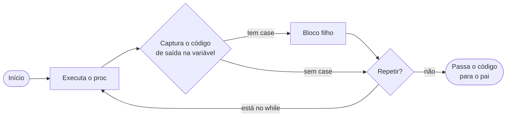

# Genjin — Manual da Linguagem

Versão: 2.0.0 | Data: 2026-05-17

---

## O que é Genjin?

Genjin é uma linguagem de programação orientada a **fluxos de execução com tratamento estático de erros**.

Você já escreveu um script que chama uma API, e se der timeout você quer tentar de novo, mas se der erro de autenticação você quer logar e abortar, e se der sucesso você quer avançar para o próximo passo — e em algum momento percebeu que esqueceu de tratar um dos casos possíveis? Genjin resolve exatamente isso.

A linguagem força você a **declarar o que fazer com cada resultado possível** de cada chamada. Se você esquecer um caso, o compilador rejeita o programa antes mesmo de executar. O resultado é um fluxo robusto, sem caminhos silenciosos.

### Em vez de:

```
resultado = verificar_rede()
if resultado == "online":
    # ... continua
# e se for "offline"? e se der "timeout"? o programa segue em estado indefinido
```

### Com Genjin:

```gnj
exec verificar_rede() >> status {
    case OFFLINE : exec aguardar(segundos=5) {
        pass DONE, ERROR
    } while(ERROR)
    pass ONLINE
}
```

Todos os caminhos são explícitos. O compilador valida.

---

## Conceito central — A Célula de Operação

Todo programa Genjin é uma árvore de **blocos de execução**. Cada bloco segue sempre o mesmo ciclo:



1. **Executa** o procedimento associado ao bloco
2. **Captura** o código de saída em uma variável de estado
3. **Ramifica** se houver um `case` para aquele código (abre um bloco filho)
4. **Repete** se o resultado estiver no `while`
5. **Passa** o código para o bloco pai se não foi tratado aqui

Essa estrutura se repete recursivamente em toda a árvore. É a única estrutura de controle do Genjin — e é suficiente para expressar qualquer fluxo.

---

## Estrutura de um programa

Todo programa `.gnj` tem quatro partes obrigatórias e um bloco opcional de configuração.

```gnj
config {                     // opcional
    renderer from "biblioteca.Macro"
}

program "nome do programa"

vars {
    // variáveis de estado
}

procs {
    // procedimentos disponíveis
}

exec proc_raiz(...) >> variavel_raiz {
    // fluxo de execução
}
```

| Seção | Obrigatória | O que declara |
|---|:---:|---|
| `config` | **não** | Parâmetros do gerador de código. Pode vir antes ou depois de `program`. |
| `program` | sim | Nome do programa. |
| `vars` | sim | Variáveis de estado que guardam resultados |
| `procs` | sim | Procedimentos que o programa pode executar |
| `exec` (raiz) | sim | O fluxo de execução — exatamente um bloco raiz |

> As seções `vars`, `procs` e `exec` podem aparecer em qualquer ordem após `program`. O bloco `config` pode aparecer antes ou depois de `program`.

---

## Comentários

```gnj
// Comentário de linha

/* Comentário
   de bloco */
```

---

## Configuração do gerador (`config`)

O bloco `config` é **opcional** e permite trocar os componentes que o motor Genjin usa para gerar código. Útil quando você precisa de um renderer diferente do padrão ou quer injetar hooks de execução.

```gnj
config {
    renderer      from "minha_lib.MeuRenderer"
    logger        from "genjin.BLANK_LOGGER"
    pre_execution  from "hooks.Setup"
    post_execution from "hooks.Teardown"
}
```

Cada chave é independente — declare apenas o que quiser sobrescrever:

| Chave | O que controla | Default |
|---|---|---|
| `renderer` | Qual macro gera o código final | `MACROMOD` |
| `logger` | Macro de logging durante a execução | — (motor decide) |
| `pre_execution` | Hook executado antes de cada proc | — |
| `post_execution` | Hook executado após cada proc | — |

O valor sempre segue o formato `"biblioteca.Macro"` — a mesma notação usada em `procs`.

O bloco `config` pode aparecer **antes ou depois** de `program`.

---

## Variáveis (`vars`)

Variáveis guardam o código de saída de cada passo do fluxo.

```gnj
vars {
    status_rede: Logic
    tentativas: Number = 0
    mensagem: Text
    logs: Text[]
}
```

### Tipos

| Tipo | Descrição |
|---|---|
| `Number` | Inteiro ou decimal |
| `Text` | Cadeia de texto |
| `Logic` | Booleano (`true` / `false`) |

### Cardinalidade

| Sintaxe | Descrição |
|---|---|
| `nome: Tipo` | Valor único |
| `nome: Tipo[]` | Lista de valores |

### Valor inicial

```gnj
status_conexao: Text = "idle"
```

---

## Procedimentos (`procs`)

Procs são as ações que seu programa pode executar. Cada proc é vinculado a uma macro externa via `from`.

```gnj
procs {
    verificar_rede() from "Net.check" {
        codes ONLINE<0>, OFFLINE<1>, TIMEOUT<2>
    }

    aguardar(segundos: Number) from "Sys.sleep" {
        codes DONE<0>, ERROR<5>
    }

    enviar(texto: Text, resposta: &Text) from "Sys.send" {
        codes OK<0>, TIMEOUT<10>, FALHA<99>
    }
}
```

### Resolução do `from`

O caminho em `from` segue a regra: **o último segmento é o nome da macro; o restante é a biblioteca**.

| `from "..."` | Biblioteca | Macro |
|---|---|---|
| `"Net.check"` | `Net` | `check` |
| `"Sys.sleep"` | `Sys` | `sleep` |
| `"Federal.@.MeuProjeto"` | `Federal.@` | `MeuProjeto` |

### Parâmetros

| Sintaxe | Passagem | Descrição |
|---|---|---|
| `param: Tipo` | por valor | Recebe um literal (`5`, `"texto"`, `true`) |
| `param: &Tipo` | por referência | Recebe uma variável; o proc pode escrever nela |
| `param: Tipo[]` | por referência (implícita) | Lista; `&` é proibido, referência é automática |
| `param: Object` | por valor | Dado opaco (lista ou dicionário); sem `&` e sem `[]` |

### Códigos de saída (`codes`)

Todo proc declara os códigos que pode retornar:

```gnj
codes NOME<numero>, NOME<numero>, ...
```

Exemplo: `codes ONLINE<0>, OFFLINE<1>, TIMEOUT<2>`

---

## O bloco `exec` — forma canônica

O bloco `exec` é onde o fluxo acontece. Forma completa:

```gnj
exec nome_do_proc(param=valor) as "nome opcional" >> variavel {
    case CODIGO_A : exec outro_proc(...) { ... }
    case CODIGO_B : exec mais_um_proc(...) { ... }
    pass CODIGO_C, CODIGO_D
} while(CODIGO_E)
```

### Vinculação de variável (`>>`)

O operador `>>` associa o bloco a uma variável. O código de saída é armazenado nela.

```gnj
exec verificar_rede() >> status_rede { ... }
```

**Herança:** se um bloco filho não declara `>>`, ele herda a variável do pai.

### Nome do bloco (`as`)

Por padrão o nome do bloco é o nome do proc. Para dar um nome explícito:

```gnj
exec aguardar(segundos=5) as "aguardar rede" { ... }
```

O `as` vem **antes** do `>>`.

### Argumentos

```gnj
exec aguardar(segundos=5) { ... }          // literal
exec enviar(texto="OK", resposta=&res) { ... }  // referência com &
```

### `case` — ramificação

```gnj
case OFFLINE : exec aguardar(segundos=5) {
    pass DONE, ERROR
}
```

Um `case` sempre leva a um novo bloco `exec`. Cada código distinto pode ter seu próprio `case`.

### `pass` — delegação

Todos os códigos não tratados por `case` ou `while` **devem** aparecer em `pass`:

```gnj
pass ONLINE, OK, TIMEOUT
```

### `while` — repetição

Aparece após o `}` do bloco. Quando o resultado (incluindo o que veio de blocos filhos) bate com um código listado, o proc do bloco é executado novamente:

```gnj
exec conectar() >> status {
    pass OK
} while(FALHA)
```

### Exemplo completo canônico

```gnj
exec verificar_rede() >> status {
    case OFFLINE : exec aguardar(segundos=5) {
        case DONE : exec enviar(texto="online", resposta=&res) >> status2 {
            pass OK, TIMEOUT, FALHA
        }
    } while(ERROR)
    pass ONLINE, OK, TIMEOUT, FALHA
}
```

**Leitura:**
1. Executa `verificar_rede()`, resultado em `status`
2. Se `OFFLINE`: executa `aguardar(5)` (herda `status`)
   - Se `DONE`: executa `enviar(...)`, resultado em `status2`
     - `OK`, `TIMEOUT` e `FALHA` sobem para o pai
   - Se `ERROR`: repete `aguardar` (`while`)
3. `ONLINE`, `OK`, `TIMEOUT` e `FALHA` sobem para fora

---

## Notação inline — açúcar sintático

A notação inline permite escrever fluxos simples de forma compacta. É expandida automaticamente para a forma canônica.

### Átomo simples

```gnj
@proc(args) >> var
@proc(args) >> var while(CODIGO)
@proc(args) >> var while(A, B)
```

Equivalência:

```gnj
@aguardar(segundos=5) >> status while(ERROR)
```

expande para:

```gnj
exec aguardar(segundos=5) >> status {
    pass DONE
} while(ERROR)
```

### Encadeamento com `when`

Vários átomos em sequência, onde cada um (exceto o último) tem `when(CODIGO)`:

```gnj
@verificar_rede()    when(ONLINE)
@autenticar()        when(OK)
@carregar_dados()    >> res
```

expande para:

```gnj
exec verificar_rede() {
    case ONLINE : exec autenticar() {
        case OK : exec carregar_dados() >> res {
            pass <todos os códigos de carregar_dados>
        }
        pass ERR
    }
    pass OFFLINE
}
```

### Regras da notação inline

- A ordem dos modificadores em cada átomo é obrigatória: `@proc([args]) [>> var] [while(CODES)] [when(CODE)]`
- `when` só é permitido nos átomos não-terminais (todos exceto o último)
- O átomo terminal não pode ter `when`
- `while` aceita um ou mais códigos: `while(A)`, `while(A, B)`

### Inline dentro de `exec` canônico

A notação inline pode aparecer como corpo de um `case`:

```gnj
exec verificar_rede() >> status {
    case ONLINE: @autenticar()     when(OK)
                 @carregar_dados() >> res
    pass OFFLINE
}
```

---

## Importação de procs externos

Procs declarados em outros arquivos `.gnj` podem ser importados para evitar repetição:

```gnj
procs {
    // procs locais normais...

    from "caminho.do.arquivo" import
        NomeBloco1,
        NomeBloco2
}
```

O compilador injeta automaticamente todas as dependências transitivas do bloco importado — você não precisa declarar manualmente os procs que ele usa internamente.

### Resolução do caminho

O caminho `"a.b.c"` é resolvido como `a/b/c.gnj` a partir do diretório do arquivo atual.

### Erros comuns

| Situação | Erro |
|---|---|
| Arquivo não encontrado | `ResolveImportError` com o path tentado |
| Nome não existe no arquivo externo | `ResolveImportError` com o nome e o arquivo |
| Conflito com proc local de mesma definição | Silencioso (ignorado) |
| Conflito com proc local de definição diferente | `ResolveImportError` de conflito |
| Importação circular | `ResolveImportError` indicando o ciclo |

---

## Exemplos completos

### Exemplo 1 — Verificar rede com retry

```gnj
program "Monitor de Rede"

vars {
    status_rede: Number
    resposta: Text
}

procs {
    verificar_rede() from "Net.check" {
        codes ONLINE<0>, OFFLINE<1>
    }

    aguardar(segundos: Number) from "Sys.sleep" {
        codes DONE<0>, ERROR<5>
    }

    notificar(msg: Text) from "Sys.notify" {
        codes OK<0>, FALHA<1>
    }
}

exec verificar_rede() >> status_rede {
    case OFFLINE : exec aguardar(segundos=10) {
        pass DONE, ERROR
    } while(ERROR)
    case ONLINE : exec notificar(msg="Rede OK") {
        pass OK, FALHA
    }
    pass OK, FALHA
}
```

**Fluxo:**
- `OFFLINE` → aguarda 10s, repete se `ERROR`, sobe `DONE`
- `ONLINE` → notifica, sobe `OK` ou `FALHA`
- O bloco pai recebe `OK` ou `FALHA` como resultado final

---

### Exemplo 2 — Autenticação em cadeia (inline)

```gnj
program "Login"

vars {
    auth: Number
    dados: Text[]
}

procs {
    verificar_token() from "Auth.check_token" {
        codes VALIDO<0>, EXPIRADO<1>, INVALIDO<2>
    }

    renovar_token() from "Auth.refresh" {
        codes OK<0>, ERRO<1>
    }

    carregar_perfil(resultado: &Text[]) from "Api.perfil" {
        codes OK<0>, ERRO<1>
    }
}

exec verificar_token() >> auth {
    case EXPIRADO : exec renovar_token() >> auth {
        case OK : exec carregar_perfil(resultado=&dados) {
            pass OK, ERRO
        }
        pass ERRO
    }
    case VALIDO : exec carregar_perfil(resultado=&dados) {
        pass OK, ERRO
    }
    pass INVALIDO, OK, ERRO
}
```

O mesmo programa usando notação inline:

```gnj
exec verificar_token() >> auth {
    case EXPIRADO: @renovar_token() >> auth when(OK)
                   @carregar_perfil(resultado=&dados)
    case VALIDO:   @carregar_perfil(resultado=&dados)
    pass INVALIDO, OK, ERRO
}
```

---

### Exemplo 3 — Loop de retry com limite

```gnj
program "Upload com Retry"

vars {
    upload_status: Number
    tentativas: Number = 0
}

procs {
    incrementar(n: &Number) from "Util.inc" {
        codes OK<0>
    }

    checar_limite(n: Number) from "Util.check_limit" {
        codes DENTRO<0>, EXCEDIDO<1>
    }

    fazer_upload() from "Storage.upload" {
        codes OK<0>, ERRO<1>
    }
}

exec fazer_upload() >> upload_status {
    case ERRO : exec incrementar(n=&tentativas) {
        case OK : exec checar_limite(n=tentativas) {
            pass DENTRO, EXCEDIDO
        }
    }
    pass OK, DENTRO, EXCEDIDO
} while(DENTRO)
```

**Fluxo:**
- `ERRO` → incrementa tentativas → checa limite
  - `DENTRO` → `while` → repete o upload
  - `EXCEDIDO` → sobe para fora (desiste)
- `OK` → sobe para fora (sucesso)

---

## Referência rápida

### Estrutura do programa

```gnj
program "nome"
vars { ... }
procs { ... }
exec proc() >> var { ... }
```

### Variáveis

```gnj
nome: Tipo              // singular
nome: Tipo = valor      // com valor inicial
nome: Tipo[]            // lista (plural)
```

### Procedimentos

```gnj
nome(p: Tipo, q: &Tipo, r: Tipo[]) from "Lib.macro" {
    codes NOME<n>, ...
}
```

### Exec canônico

```gnj
exec proc(a=val, b=&var) as "nome" >> var {
    case CODIGO : exec outro(...) { ... }
    pass OUTROS
} while(REPETE)
```

### Notação inline

```gnj
@proc(args) >> var [while(CODES)] [when(CODE)]
```

### Importação

```gnj
from "caminho.dotted" import NomeBloco1, NomeBloco2
```

### Tipos de parâmetro

| Sintaxe | Tipo passado |
|---|---|
| `p: Number` | literal numérico |
| `p: Text` | literal de texto |
| `p: Logic` | literal booleano |
| `p: &Text` | referência a variável `Text` |
| `p: Text[]` | referência a lista (implícita) |
| `p: Object` | objeto opaco literal |

### Construtos de tratamento de código

| Construto | Descrição |
|---|---|
| `case CODIGO : exec ...` | Ramifica para um bloco filho |
| `pass A, B, C` | Delega ao bloco pai |
| `} while(A, B)` | Repete este bloco quando o resultado for A ou B |
